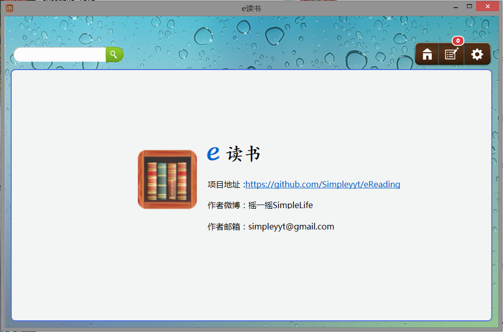

eReading v1.2
==================

从读秀、文献港上搜索、下载电子书，并把电子书转为PDF。由于现有的软件使用太蛋疼，因此作者自己写了一个。
 
</img>
如何使用
---------
1. 本软件的运行环境需[.Net4.0环境](http://download.microsoft.com/download/9/5/A/95A9616B-7A37-4AF6-BC36-D6EA96C8DAAE/dotNetFx40_Full_x86_x64.exe)。
2. 下载STR数据库，重命名为bookdb.db放于可执行文件的目录下。

常见问题
---------
* 有些书需要STR才能下载，什么是STR？怎么获得？
 有了STR才知道读秀图书的真实下载地址。
     自带的数据库毕竟有限，可以上淘宝买STR，告诉其SS号就行了。

* STR数据库哪里有？
 直接向我要吧。

* 为什么STR数据库那么大？
 因为这个数据库包含20多万图书的STR。

* 只能在校内网使用吗？校外网怎么使用？
 在校外网时，可以使文献港，但是相对来说资源少。
     要使用读秀的话，必须登录用VPN登录后，才能使用。
     中大的VPN ip为vpn.sysu.org.cn，用NetID登录即可。

* 为什么到99%就很不前进了？
 正在生成PDF，可能会慢点；别急，喝杯茶吧，少年。

* 下载提示SQL error，怎么会这样？
 数据库出问题了，再检查一下位置和命名。

* 为什么设置里那么多不能设置？为什么只支持单任务？为什么不能保存进度？为什么不能保存列表？
 因为作者不想写了。╮(╯▽╰)╭

* 发现BUG怎么办？
 我的邮箱：simpleyyt@gmail.com。

已发现的BUG
-------------
* 硬盘空间不够时，会频繁出现下载错误。
* 超出1000页的书，部分无法下载。

更新日志
---------
### v1.2
* 优化代码，解决CPU占用率过高问题。
* 修复界面响应过慢问题。
